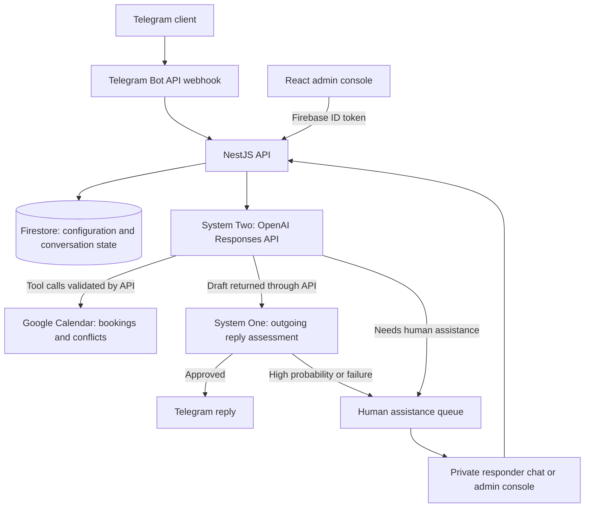

# Telegram Booking Assistant

TypeScript monorepo for a Telegram Business massage-booking assistant and its admin console. The assistant answers service questions, proposes appointments, creates confirmed bookings in Google Calendar, and hands conversations to a human when necessary.

This overview describes the implementation on `main`. Product behavior is defined in [SPEC.md](SPEC.md); contributor workflow is defined in [AGENTS.md](AGENTS.md).

## Architecture



The browser communicates with the API rather than reading Firestore directly. Firebase Hosting serves the admin SPA and forwards `/api/**` to the `api` Cloud Function in `europe-west1`. Locally, Vite forwards the same prefix to the NestJS server.

| Location                                         | Responsibility                                                                                                    |
| ------------------------------------------------ | ----------------------------------------------------------------------------------------------------------------- |
| [`apps/api`](apps/api)                           | NestJS API, Telegram processing, AI orchestration, booking validation, Google OAuth, and persistence              |
| [`apps/admin`](apps/admin)                       | React, Vite, MUI, and TanStack Query UI for conversations, services, settings, prompts, schedule, and diagnostics |
| [`packages/contracts`](packages/contracts)       | Shared Zod schemas and transport types used by the API and admin UI                                               |
| [`packages/domain`](packages/domain)             | Framework-independent domain rules and errors                                                                     |
| [`packages/config`](packages/config)             | Environment configuration and validation                                                                          |
| [`packages/http`](packages/http)                 | Shared HTTP behavior, including retry and replay safeguards                                                       |
| [`services/telegram-mcp`](services/telegram-mcp) | Private Python bridge for the separate Telegram account AI workspace                                              |
| [`firebase`](firebase) and [`scripts`](scripts)  | Hosting, Firestore rules/indexes, release preparation, and deployment configuration                               |

pnpm workspaces and Turborepo coordinate development, builds, and checks. Firebase Functions runs the API with Node.js 22.

## Main flows

### 1. Receive a message and generate a reply

The entry point is [`TelegramService`](apps/api/src/telegram.service.ts).

Message updates also trigger a best-effort schedule refresh when due.

1. `POST /telegram/webhook` validates the Telegram secret header and update schema. Only eligible private client messages are processed. Bot settings select allowed usernames or enable all users.
2. A Firestore transaction claims the update to prevent duplicate processing. The API loads the conversation and checks whether automation is enabled or paused for a human.
3. Business messages can use configured read and typing delays before reply generation and delivery.
4. **System Two (S2)** generates the reply and requests any required tools. The API executes those tools with the server-bound client identity and validated arguments.
5. **System One (S1)** assesses the exact outgoing draft before delivery. A failed assessment or a probability above the configured threshold opens a human assistance case and withholds the draft.
6. An approved reply is sent through the Telegram Bot API, using the Business connection when applicable. Only an acknowledged delivery is saved as an assistant message.

Incoming messages during human takeover are stored and forwarded to the responder queue without an AI response. A Telegram deletion update clears stored dialogue context and pending actions while retaining booking and human assistance state.

### 2. S2: compose answers and use tools

[`OpenAiService`](apps/api/src/openai.service.ts) builds a fresh, stateless OpenAI Responses request for each booking conversation turn (`store: false`). It does not depend on a provider-side conversation ID.

Each turn includes:

- The editable assistant prompt, or its code default, plus mandatory booking, consent, security, formatting, and media instructions.
- The effective knowledge base, enabled services with duration/price options and buffers, current time, configured timezone, and pending proposal state.
- Up to 19 stored history messages within a 12,000-character budget, followed by the current client message once.
- Tool results produced during that turn. Tool calls and their matching results are appended to the request context.

The tool loop is bounded to five model rounds, with tools disabled for the final round. Provider requests have a 30-second deadline within a 60-second S2 turn budget. Generated reply text is limited to 4,000 characters.

| Tool                       | Purpose                                                                                     |
| -------------------------- | ------------------------------------------------------------------------------------------- |
| `get_services`             | Read enabled services and their supported duration/price options                            |
| `get_booking_context`      | Read the current schedule snapshot and live Calendar conflicts                              |
| `get_bookings`             | Read bookings belonging to the current client/chat                                          |
| `get_media`                | Discover enabled, eligible media and cooldown metadata                                      |
| `send_media`               | Send contextual media to the current chat, with at most one attempt per turn                |
| `prepare_booking`          | Validate an appointment and store a pending proposal                                        |
| `create_booking`           | Create the server-bound pending appointment after client confirmation; accepts no arguments |
| `request_human_assistance` | End AI processing and transfer the conversation to a human                                  |

S2 interprets conversational intent and the schedule text. The server verifies service options, dates, proposal ownership, expiry, delivery evidence, and Calendar conflicts. The model cannot choose a different client identity or silently replace the details of a confirmed proposal.

Prompt and knowledge-base overrides are read from Firestore. Resetting an override restores the code default. See [S2 prompt documentation](docs/s2-prompts.md).

### 3. S1: assess the outgoing draft

S1 on `main` estimates **how likely the outgoing reply sounds like a bot in context**. It assesses rather than rewrites the reply. [`HumanAssistanceService`](apps/api/src/human-assistance.service.ts) passes up to 20 recent conversation messages, including the current incoming message, and the outgoing draft separately to the configured selector.

The selector returns a validated probability between `0` and `1`. A reply passes when the probability is below `1` and its percentage is at or below the configured threshold. A probability of `1` always requires a human, including when the threshold is `100%`.

The default selector is OpenAI. TypeSafe can be selected in settings, with OpenAI fallback if TypeSafe fails to return a usable result. S1 uses its own editable handoff prompt and does not receive S2's knowledge base or booking tools. Assessment failure withholds the draft rather than sending an unchecked fallback. Human-authored replies bypass this assessment.

### 4. Propose, confirm, and create a booking

Google Calendar is the source of truth for active bookings. The flow spans [`AssistantToolsService`](apps/api/src/assistant-tools.service.ts), [`BookingService`](apps/api/src/booking.service.ts), and [`CalendarService`](apps/api/src/calendar.ts).

1. S2 calls `prepare_booking` with an enabled service, supported duration, and timezone-aware start time.
2. The server checks fresh schedule availability, a future start within the supported 30-day horizon, and Calendar conflicts including the service buffer. It stores a proposal with immutable service, duration, local date/time, price, and currency facts. The proposal expires after 15 minutes.
3. S2 presents those facts to the client. The application validates the proposal facts in the draft and records a private proposal ID only after Telegram confirms delivery.
4. On a later turn, S2 interprets the client's clear approval and calls argument-free `create_booking`. The server checks proposal ownership, expiry, automation state, and evidence that the matching proposal was delivered.
5. A Firestore transaction consumes the proposal once. The booking service rechecks the current catalog and Calendar conflicts, creates a managed Calendar event with a stable ID, verifies it, and checks conflicts again.

Missing or stale schedule data and unavailable Calendar access do not imply a free appointment. Ambiguous booking writes or delivery results require human review. Cancellations and rescheduling are handled by a human.

Calendar conflict checks and event creation are separate external operations; they are not one atomic reservation across concurrent instances. The readback and follow-up checks detect conflicts, but uncertain outcomes still require reconciliation.

### 5. Transfer to a human and resume

A terminal S2 handoff, high S1 probability, assessment failure, or uncertain booking/delivery can open one active assistance case for the conversation. The case includes the transcript, relevant context, and any unsent draft. Automation pauses; the withheld draft is not recorded as a delivered assistant reply.

Configured responders register through a private `/start` message. Their Telegram identity and authorization are checked when handling a case:

- `/answer <requestId> <text>` claims the case, sends a human reply through the original Bot/Business chat, and closes the case after successful delivery.
- `/resume <requestId>` releases the pause for future messages without replaying the withheld draft.
- Protected admin endpoints offer the same reply and release operations.

Transactional claims prevent competing responders from sending the same case response. Uncertain send outcomes remain paused for review.

### 6. Import schedules and deliver media

The owner connects a Telegram **user account** using phone/code and, if required, a password. Its encrypted MTProto session is separate from the bot token. An owner selects a schedule chat and optional forum topic.

Automatic schedule import uses a shared lease and five-minute cooldown. It stores up to five recent text messages with their timestamps and diagnostics. Booking context combines a successful, nonempty snapshot no older than five minutes with live Google Calendar busy intervals. S2 interprets the raw schedule text.

Media metadata lives in Firestore and files live in Cloud Storage. S2 receives descriptive metadata rather than file URLs. The API controls the destination, enabled state, cooldown, and delivery lease. Uncertain delivery is treated conservatively to avoid automatic duplicate sends.

### 7. Separate AI workspace for Telegram account actions

The admin `/ai-chat` workspace is separate from the booking bot. Threads belong to the signed-in Firebase user and use stored OpenAI conversations. The assistant can read chats/messages, search, and propose a send or reply through the connected Telegram user account.

A proposal displays the exact recipient and text for explicit confirmation or cancellation. Actions expire after ten minutes and are claimed before the external operation. An uncertain result is not automatically retried.

The API invokes the private Python MCP bridge on Cloud Run using a Google identity token. The bridge receives the Telegram session transiently and runs the pinned Telegram MCP implementation. This bridge has its own deployment and IAM setup; it is not deployed by `firebase:deploy:code`. See [Telegram MCP setup](services/telegram-mcp/README.md).

## Storage, authentication, and HTTP boundaries

| System                  | Stored data / role                                                                                                                                                                               |
| ----------------------- | ------------------------------------------------------------------------------------------------------------------------------------------------------------------------------------------------ |
| Firestore               | Conversation history and state, update claims, pending proposals, human cases, services, prompt/KB overrides, settings, schedule snapshots, access grants, and encrypted integration credentials |
| Google Calendar         | Active bookings, ownership/service metadata, and bounded conversation context attached to managed events                                                                                         |
| Cloud Storage           | Media files and private diagnostic payloads                                                                                                                                                      |
| Secret Manager          | Production API credentials and encryption keys                                                                                                                                                   |
| Firebase Authentication | Google sign-in and ID tokens for the admin console                                                                                                                                               |

Legacy Firestore booking/slot records are retained as archival data; live booking availability and listing use Calendar. Firestore rules deny direct browser access, and the API uses the Firebase Admin SDK with application-default credentials. There is no in-memory persistence fallback.

The API verifies Firebase bearer tokens for `/admin/**`. `ADMIN_UIDS` defines owners; configured verified stakeholder emails can receive admin access. Sensitive account operations and access management require owner authorization.

| Endpoint                       | Access / purpose                                                    |
| ------------------------------ | ------------------------------------------------------------------- |
| `GET /health`                  | Public process health; does not verify every external integration   |
| `POST /telegram/webhook`       | Telegram update ingestion protected by the configured secret header |
| `GET /public/services`         | Public enabled-service fields for the FAQ                           |
| `/admin/**`                    | Authenticated admin operations                                      |
| `/docs/`, `/docs/openapi.json` | Admin-protected Swagger UI and generated OpenAPI schema             |

Paths above are API paths. Through Firebase Hosting or the Vite proxy they have the `/api` prefix, for example `/api/docs/`.

Routine diagnostics redact secrets. The designated debug owner can retrieve private request/response payloads through protected endpoints; these payloads can contain prompts and client messages.

## Quick start

Requirements: Node.js 22 or newer, pnpm `11.9.0`, and Firebase credentials or a configured emulator environment.

1. Install dependencies with `pnpm install`.
2. Configure backend settings in the root `.env` for local development. Shell environment values take precedence.
3. Configure Firebase web settings in `apps/admin/.env.local`: `VITE_FIREBASE_API_KEY`, `VITE_FIREBASE_AUTH_DOMAIN`, `VITE_FIREBASE_PROJECT_ID`, and `VITE_FIREBASE_APP_ID`.
4. Select a development Firebase project and provide application-default credentials or configure the SDKs for emulators. Starting emulator processes alone does not configure every application client.
5. Start the API and admin console:

```bash
pnpm dev
```

The admin console runs at `http://localhost:5173`; the API defaults to `http://localhost:2301`. The admin dev server proxies `/api` to that default API port.

The main backend configuration groups are:

| Integration            | Settings                                                                                                    |
| ---------------------- | ----------------------------------------------------------------------------------------------------------- |
| Firebase and access    | `FIREBASE_PROJECT_ID`, `ADMIN_UIDS`, optional `DEBUG_OWNER_UID`                                             |
| Telegram bot           | `TELEGRAM_BOT_TOKEN`, `TELEGRAM_WEBHOOK_SECRET`                                                             |
| AI                     | `OPENAI_API_KEY`, `OPENAI_MODEL`; optional `TYPESAFE_AI_TOKEN` for S1                                       |
| Google Calendar        | Google OAuth client settings and `GOOGLE_CALENDAR_ENCRYPTION_KEY`; connect the account through the owner UI |
| Telegram account       | `TELEGRAM_API_ID`, `TELEGRAM_API_HASH`, `TELEGRAM_SESSION_ENCRYPTION_KEY`                                   |
| Telegram MCP workspace | Backend-only `TELEGRAM_MCP_BRIDGE_URL` and Cloud Run invocation permission                                  |
| Runtime                | `PORT` and `DEFAULT_TIMEZONE` (default `Europe/Kyiv`)                                                       |

Encryption keys must be 32 random bytes encoded as base64. Preserve existing keys when reusing encrypted credentials. See [local development](docs/local-development.md) and [deployment configuration](docs/deployment.md) for setup details.

### Development commands

| Command                   | Purpose                                                                   |
| ------------------------- | ------------------------------------------------------------------------- |
| `pnpm dev`                | Run API and admin development servers                                     |
| `pnpm lint`               | Lint workspaces                                                           |
| `pnpm typecheck`          | Check TypeScript types                                                    |
| `pnpm test`               | Run workspace tests and root script tests                                 |
| `pnpm build`              | Build workspaces                                                          |
| `pnpm firebase:emulators` | Start Firebase emulators using repository configuration                   |
| `pnpm seed`               | Write development catalog/schedule data to the selected Firestore project |

Use `seed` only with the intended development project. Production startup does not seed data. Functional changes follow specification → tests/contracts → implementation → validation, as documented in [AGENTS.md](AGENTS.md).

## Deployment

From the repository root, deploy Firebase Hosting and the API to `anna-ai-assistant`:

```bash
pnpm firebase:deploy:code
```

This command validates locally supplied encryption keys, builds the workspaces, prepares release artifacts, and deploys Hosting and the `api` function.

Root `.env` is not uploaded. Production secrets come from Secret Manager; export the required nonsecret runtime settings before running the command. The script does not automatically preserve deployed settings. See [deployment setup and configuration](docs/deployment.md) before deploying.

Production deployment requires an explicit user request, as defined in [AGENTS.md](AGENTS.md).

## Further reading

- [Product specification](SPEC.md)
- [Architecture details](docs/architecture.md)
- [Data model](docs/data-model.md)
- [S2 prompts](docs/s2-prompts.md)
- [Local development](docs/local-development.md)
- [Deployment and production configuration](docs/deployment.md)
- [Telegram MCP bridge](services/telegram-mcp/README.md)
